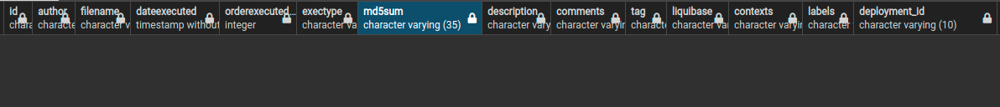
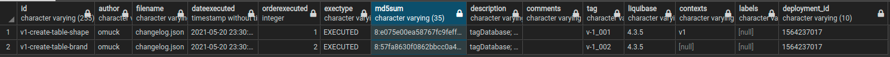

# Liquibase

---
Breve explicação sobre o liquibase.

### O quê é?
É uma biblioteca independente de banco de dados, que serve para gerenciar e aplicar alterações em um determinado banco.

### Conceitos

- Liquibase.properties
- Changelog
- ChangeSet
- Changelog Database
- Changelog Database Lock

#### 1. liquibase.properties
- É o arquivo que possui a configuração do projeto liquibase. Onde se tem a conexão com o banco,
indicação do arquivo changeLog, etc.

#### 2. ChangeLog
- É o arquivo que possui os comandos para a manipulação do banco de dados.

#### 3. ChangeSet 
- É o responsável pela manipulação do banco, chageSets são as unidades de um arquivo changelog. Cada changeSet possui um trecho de comando,
sendo informado o autor e o id. Pode ser em sql, json, xml, etc. No final, deve haver diversos changeSets formando um changeLog File.

#### 4. ChangeLog Database
- É o banco de dados de Log, onde armazena as informações de histórico. Armazena id, autor, data de execução, md5sum, etc. É o log de 
changeSets, cada um ocupa uma linha na tabela. 
  
#### 5. ChangeLog Database Lock
- É o banco de log que impede algum changeSet de outro autor, ser executado antes de um changeSet, que está em execução.

### Alguns Comandos
- #### update
    Faz um update no banco de dados de acordo com o ChangeLog e a tabela de log.
  ```bash
  liquibase update
  ```
- #### updateCount 
    Faz um update no banco de dados de acordo com o ChangeLog e a tabela de log, mas até um certo ponto para frente, de acordo
com o valor especificado.
    ```bash
    liquibase updateCount <valor>
    ```  
- #### updateToTag
    Faz um update no banco de dados de acordo com o ChangeLog e a tabela de log, mas somente até um changeSet específico,
localizado pela tag.
    liquibase updateToTag tag
  
- #### rollback
    Faz um rollback no banco até uma tag específica.
  
    ```bash
    liquibase rollback <tag>
    ``` 

### Funcionamento
Antes de tudo, deve-se configurar o arquivo liquibase.properties. Passando a url do banco, usuário, senha,
driver e qual é o arquivo changeLog.

Para manipular o banco de dados, deve acrescentar código ao arquivo changeLog. Como já foi explicado, ele é formado por um conjunto
de changeSet's. Cada changeSet possui um "id" e um "autor", que será a sua identificação na tabela de log, e é nele que 
será feito os comandos para a manipulação do banco.

Para servir de exemplo, segue o arquivo changeLog com um changeSet em formato json:

```json
{"databaseChangeLog": [
    {
      "changeSet":{
        "id": "v1-create-table-brand",
        "author": "omuck",
        "changes": [
          {
            "tagDatabase": {
              "tag": "v-1_002"
            }
          },
          {
            "createTable": {
              "tableName":  "brand",
              "columns": [
                {
                  "column": {
                    "name": "id",
                    "type": "int",
                    "autoIncrement": true,
                    "constraints": {
                      "primaryKey": true,
                      "nullable": false
                    }
                  }
                },
                {
                  "column": {
                    "name": "brand_name",
                    "type": "varchar(20)",
                    "constraints": {
                      "nullable": false
                    }
                  }
                }]}}]}}]}
```
Nesse exemplo, foi criado uma tabela de nome "brand" com duas colunas, "id" e "brand_name".
Segue um outro exemplo:
```json
{
  "databaseChangeLog": [
    {
      "changeSet": {
        "id": "v1-create-table-shape",
        "context": "v1",
        "author": "omuck",
        "changes": [
          {
            "tagDatabase": {
              "tag": "v-1_001"
            }
          },
          {
            "sqlFile": {
              "dbms": "postgresql",
              "path": "./v1/create-table-shape.sql"
            }
          }
        ]
      }
    }
  ]
}
```
Aqui, fica um json um pouco mais limpo, o qual indica o caminho de um arquivo .sql que será responsável pela manipulação
do banco.

```sql
--liquibase formatted sql
--Database: guitars
CREATE TABLE shape (
    ID NUMERIC(5,0) NOT NULL PRIMARY KEY,
    NAME VARCHAR(10) NOT NULL
);
```

Com o arquivo changelog tendo conteúdo, pode-se rodar o comando:
```bash
liquibase update
```
Após isso, deve ter recebido uma mensagem de suceddo e ter sido criado as duas tabelas, conforme os changeSet's.
E além delas, as tabelas "databasechangelog" e "databasechangeloglock" também.



Nessa imagem, quero dar o foco para a coluna "md5sum". Nela é armazenado um código de execução
de um determinado changeSet. Assim, o liquibase sabe quando foi e quando não foi rodado um changeSet.



Outro ponto a ser analisado é a coluna "Tag".

### Tag
A tag é um componente importante, é ela que permite um rollback com exatidão e um updateToTag
também.
Cada changeSet recebe então uma tag, pode ser a mesma que outro ou uma totalmente diferente.

Caso não tenha sido adicionado a tag para o changeSet, há um comando a ser feito:
```bash
liquibase tag <tag-name>
```
Essa tag será referência para o estado atual do banco.

### Rollback
E como comentado, o rollback é feito pela tag. É nescessário um script de rollback para ele ser efetivado,
assim como a chamada desse script. 

O rollback recebe um lugar especial no changeSet, onde é informado o caminho do script:
```json
"rollback": {
  "sqlFile": {
    "path": "./v1/rollback/rb-shape-v1_001.sql"
  }
}
```
Ele é inserido logo após a chave de "changes".

E para executar o rollback, segue o comando:
```bash
liquibase rollback <tag>
```